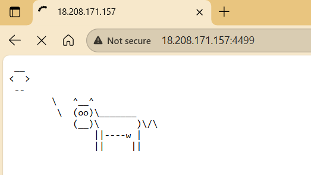
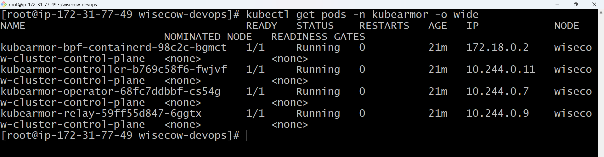

# Wisecow Kubernetes Deployment

**Production-ready Kubernetes deployment with automated CI/CD and runtime security**

## 🎯 Overview

Complete Kubernetes deployment of the Wisecow application—a bash-based web server that displays random fortune quotes in ASCII cow format. This project demonstrates containerization, orchestration, CI/CD automation, and zero-trust security implementation.

## 📸 Application in Action

### Running Application

*Wisecow application successfully running and serving HTTP traffic via exposed service*


*KubeArmor runtime security components running in the cluster*

## 🔧 Technologies Used

| Category | Tools |
|----------|-------|
| Containerization | Docker |
| Orchestration | Kubernetes |
| CI/CD | GitHub Actions |
| Security | KubeArmor (Zero-Trust Policies) |
| Monitoring | Custom Bash scripts |
| Infrastructure | AWS EC2, KinD |

## ✨ Key Features

- ✅ **Containerized Application**: Custom Dockerfile with minimal dependencies
- ✅ **Kubernetes Deployment**: Production-ready manifests with resource limits
- ✅ **Automated CI/CD**: GitHub Actions pipeline for continuous integration
- ✅ **TLS-Ready**: Ingress configured for HTTPS with certificate support
- ✅ **Zero-Trust Security**: KubeArmor policies enforcing strict access controls
- ✅ **Health Monitoring**: Custom script for application availability checks
- ✅ **Automated Backups**: Bash script for scheduled backup management

## 🏗️ Architecture

```
GitHub Repository
    ↓
GitHub Actions (CI Pipeline)
    ├─→ Build Docker Image
    ├─→ Push to Docker Hub
    └─→ Tag with commit SHA
           ↓
    Kubernetes Cluster
    ├─→ Deployment (2 replicas)
    ├─→ Service (NodePort)
    ├─→ Ingress (TLS-ready)
    └─→ KubeArmor Security Policies
```

## 🐳 Dockerfile

Minimal Ubuntu-based image with only required dependencies:

```dockerfile
FROM ubuntu:22.04

RUN apt-get update && \
    apt-get install -y fortune-mod cowsay netcat-openbsd && \
    rm -rf /var/lib/apt/lists/*

ENV PATH="/usr/games:${PATH}"

WORKDIR /app
COPY wisecow.sh .
RUN chmod +x wisecow.sh

EXPOSE 4499
CMD ["./wisecow.sh"]
```

**Image:** `userashik187/wisecow:latest`

## ☸️ Kubernetes Resources

### Deployment
- **Replicas**: 2 (high availability)
- **Resource Limits**: CPU (500m) and Memory (256Mi)
- **Image Pull Policy**: IfNotPresent
- **Port**: 4499

### Service
- **Type**: NodePort
- **Port Mapping**: 80 → 4499 (container) → 30001 (NodePort)
- **Selector**: app=wisecow

### Ingress (TLS Configuration)
- **Host**: `wisecow.local`
- **TLS Secret**: `wisecow-tls`
- **Backend**: wisecow-service:80

## 🔄 CI/CD Pipeline

### GitHub Actions Workflow

**Trigger**: Push or pull request to main branch

**Pipeline Steps:**
1. Checkout repository
2. Set up Docker Buildx
3. Login to Docker Hub (using secrets)
4. Extract metadata and create tags
5. Build Docker image with caching
6. Push to Docker Hub with tags:
   - `latest`
   - `main-<commit-sha>`

**Required Secrets:**
- `DOCKER_USERNAME`
- `DOCKER_PASSWORD`

**Workflow File:** `.github/workflows/docker-build-push.yaml`

## 🔐 Security Implementation

### KubeArmor Zero-Trust Policy

Enforces strict runtime security controls:

**Process Controls:**
- **Allowed**: `/usr/games/cowsay`, `/usr/games/fortune`, `/bin/bash`, `/usr/bin/nc`
- **Denied**: All other processes (default deny)

**File Access Controls:**
- **Allowed**: `/app/`, `/tmp/`
- **Denied**: `/etc/passwd`, `/etc/shadow`, system files

**Network Controls:**
- **Allowed**: TCP only
- **Denied**: UDP traffic

### Apply Security Policy

```bash
# Install KubeArmor
karmor install

# Apply policy
kubectl apply -f kubearmor-policies/wisecow-security-policy.yaml

# Monitor violations
karmor logs --follow
```

## 📊 Monitoring Scripts

### 1. Application Health Checker

Monitors application availability using HTTP status codes.

**Features:**
- Color-coded status output (UP/DOWN/REDIRECT)
- Logging to `app_health.log`
- Continuous monitoring mode
- Configurable timeout

**Usage:**
```bash
# Single check
./scripts/app_health_checker.sh http://localhost:8080

# Continuous monitoring (every 10 seconds)
./scripts/app_health_checker.sh http://localhost:8080 -i 10
```

### 2. Automated Backup Solution

Creates compressed backups with rotation management.

**Features:**
- `.tar.gz` compression
- Timestamp-based filenames
- Remote backup via SCP
- Configurable retention (default: 5 backups)
- Detailed logging

**Usage:**
```bash
# Local backup
./scripts/automated_backup.sh -s /var/www -d /backup -n mybackup

# Remote backup
./scripts/automated_backup.sh -s /data -d /backup -r user@server -n data_backup
```

## 🚀 Deployment Guide

### Prerequisites

- Docker (v20.10+)
- kubectl (v1.25+)
- KinD or Minikube
- Git

### Quick Start

#### 1. Clone Repository

```bash
git clone https://github.com/Ashik-Domain/wisecow-devops.git
cd wisecow-devops
```

#### 2. Test Locally with Docker

```bash
# Build image
docker build -t wisecow .

# Run container
docker run -d -p 4499:4499 --name wisecow-test wisecow

# Test application
curl http://localhost:4499
```

#### 3. Deploy to Kubernetes

```bash
# Create cluster
kind create cluster --name wisecow-cluster

# Load image
kind load docker-image userashik187/wisecow:latest --name wisecow-cluster

# Deploy resources
kubectl apply -f k8s/deployment.yaml
kubectl apply -f k8s/service.yaml

# Verify deployment
kubectl get pods
kubectl get svc

# Access application
kubectl port-forward service/wisecow-service 8080:80
# Visit: http://localhost:8080
```

#### 4. Configure TLS (Optional)

```bash
# Generate self-signed certificate
openssl req -x509 -nodes -days 365 -newkey rsa:2048 \
  -keyout tls.key -out tls.crt -subj "/CN=wisecow.local"

# Create TLS secret
kubectl create secret tls wisecow-tls --key tls.key --cert tls.crt

# Apply ingress
kubectl apply -f k8s/ingress.yaml

# Add to /etc/hosts
echo "127.0.0.1 wisecow.local" | sudo tee -a /etc/hosts

# Access via HTTPS
curl -k https://wisecow.local
```

## 📁 Repository Structure

```
wisecow-devops/
├── .github/
│   └── workflows/
│       └── docker-build-push.yaml    # CI/CD pipeline
├── k8s/
│   ├── deployment.yaml               # Kubernetes deployment
│   ├── service.yaml                  # Service definition
│   └── ingress.yaml                  # Ingress with TLS
├── kubearmor-policies/
│   ├── wisecow-security-policy.yaml  # Security policy
│   └── README.md                     # Policy documentation
├── scripts/
│   ├── app_health_checker.sh         # Health monitoring
│   ├── automated_backup.sh           # Backup automation
│   └── backup.log                    # Backup logs
├── screenshots/                      # Deployment screenshots
├── Dockerfile                        # Container definition
├── wisecow.sh                        # Application script
└── README.md                         # This file
```

## 🎓 What I Learned

- Containerizing bash-based applications with minimal dependencies
- Creating production-ready Kubernetes manifests with resource management
- Implementing automated CI/CD pipelines using GitHub Actions
- Configuring TLS/HTTPS for Kubernetes ingress
- Enforcing zero-trust security with KubeArmor runtime policies
- Writing robust bash scripts for monitoring and automation
- Managing Docker image tagging strategies for version control

## 🔄 Production Improvements

For production deployment, I would implement:

- **Non-root User**: Run container as non-privileged user
- **Specific Image Tags**: Replace `:latest` with semantic versioning
- **Liveness/Readiness Probes**: Add health checks to Kubernetes manifests
- **Resource Quotas**: Implement namespace-level resource limits
- **Secret Management**: Use Sealed Secrets or AWS Secrets Manager
- **Horizontal Pod Autoscaler**: Auto-scale based on CPU/memory
- **Network Policies**: Restrict pod-to-pod communication
- **Image Scanning**: Integrate Trivy in CI pipeline for vulnerability checks

## 📝 Technical Details

**Application**: Wisecow fortune web server  
**Base Image**: Ubuntu 22.04  
**Dependencies**: fortune-mod, cowsay, netcat-openbsd  
**Port**: 4499  
**Deployment Strategy**: Rolling updates with 2 replicas  
**Security**: Zero-trust runtime policy enforcement  

## 🔗 Related Resources

- [Original Wisecow Application](https://github.com/nyrahul/wisecow)
- [KubeArmor Documentation](https://docs.kubearmor.io/)
- [Kubernetes Documentation](https://kubernetes.io/docs/)

---

**Built as a DevOps deployment exercise demonstrating containerization, orchestration, and security best practices**
